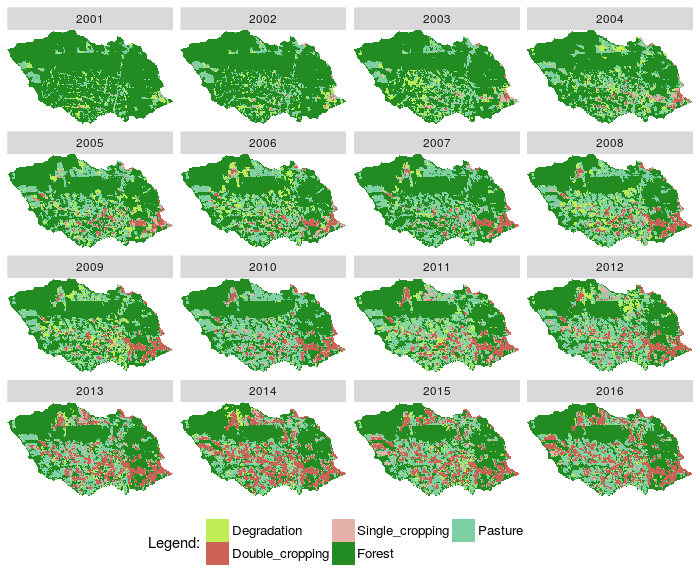
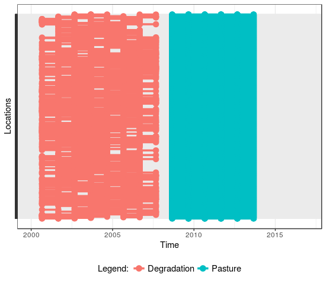
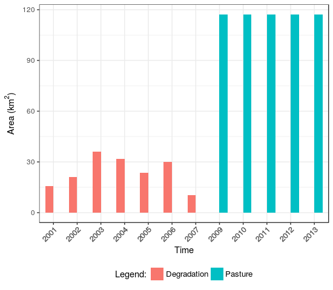
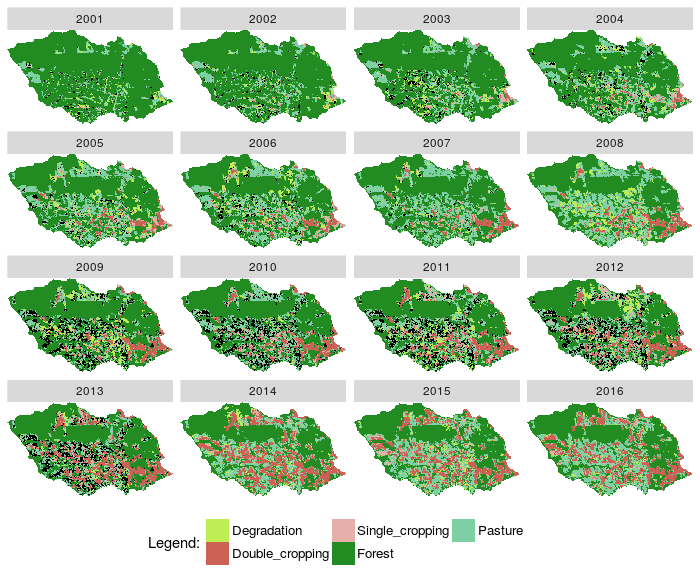
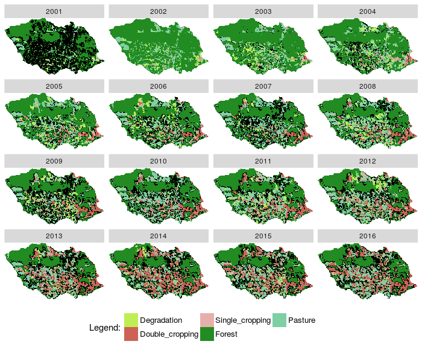
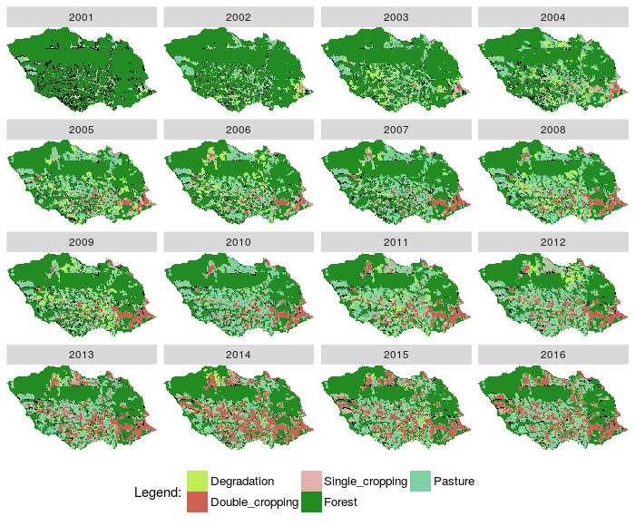
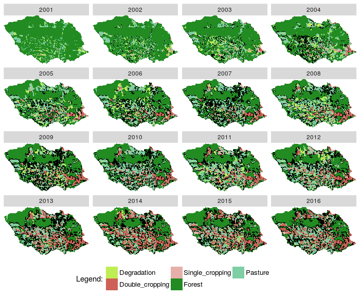
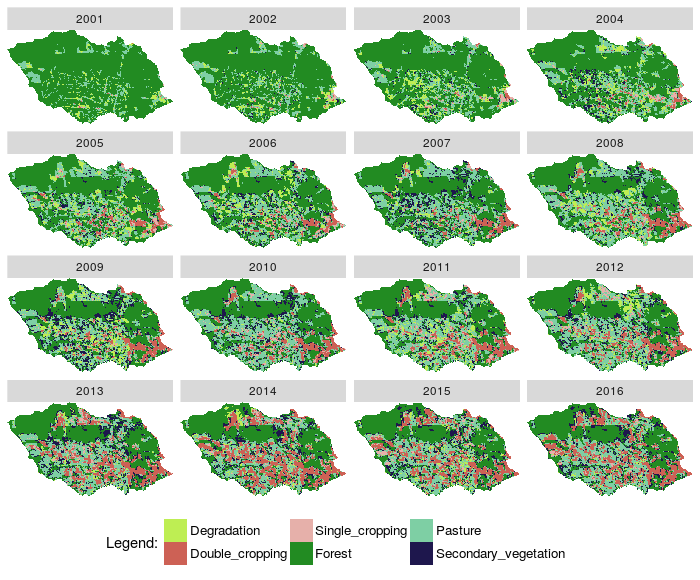
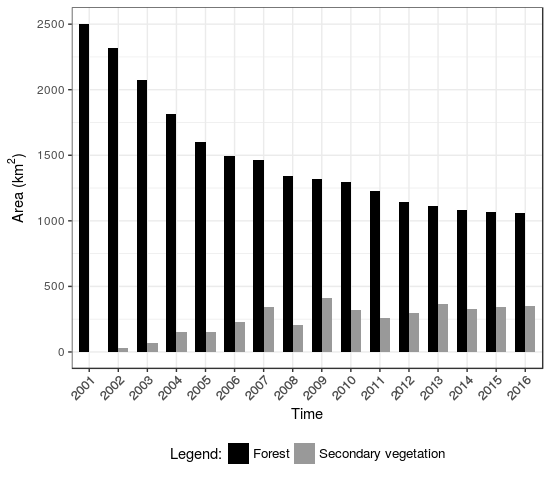
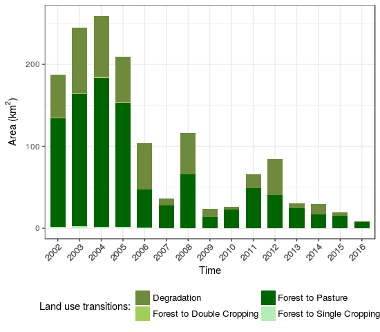

<h2>Land Use Change Calculus (lucCalculus)</h2>

This package implements the LUC Calculus for reasoning about land use change trajectories. Based on a set of classified time series, we build expressions to answer specific questions, such as <i>Which events of "Forest" areas were replaced by "Pasture"?</i>

With package "lucCalculus" is possible to build questions using Allen's interval temporal logic relationships and also others extended from their study. I suggest the reader read <a href="http://cse.unl.edu/~choueiry/Documents/Allen-CACM1983.pdf"> (Allen 1983)</a> and <a href="http://www.cs.ucf.edu/~lboloni/Teaching/EEL6938_2007/papers/Allen-GeneralTheoryActionTime.pdf"> (Allen 1984) </a> for more details. Besides, is possible to generate graphics with event information and plot maps with results. Using these events the user can to perform analysis on time series data to discover important land use changes.

<h3>Prerequisites: </h3> 
<ul>
  <li><a href="http://git-scm.com/">Git</a></li>
  <li><a href="http://www.r-project.org/">R</a></li>
  <li><a href="http://www.rstudio.com/">Rstudio</a></li>
  <li>A set of classified GeoTIFF images by year </li>
  <li>The lucCalculus requires "devtools" package is available. </li> 
</ul>

<h3>How to use the package:</h3>
<ul>
  <li>Open RStudio</li>
  <li>Install devtools <code>install.packages("devtools")</code> </li>
  <li>Load devtools <code>library(devtools)</code> </li>
  <li>Install the lucCalculus package <code>install_github("e-sensing/lucCalculus")</code> </li>
</ul>

 
<h3>Example 1</h3>
 
 - This example was perfomed in Itanhanga municipality, in Mato Grosso state, Brazil. 
 
 - Load the lucCalculus package <code>library(lucCalculus)</code>

 - Create a RasterBrick from a set of classified images

<pre class="R"> 
library(lucCalculus)
options(digits = 12)
#-----------------------
# 0. Open images and create a RasterBrick 
#-----------------------

# create a RasterBrick from individual raster GeoTIFF classified previously
lucC_create_RasterBrick(path_open_GeoTIFFs = c(system.file("extdata/raster/rasterItanhanga", package = "lucCalculus")),
                        path_save_RasterBrick = getwd())
                  
# ------------- define variables to use in metadata -------------
# open files
file <- paste0(getwd(),"/rasterItanhanga.tif")
file

# create timeline with classified data from SVM method
timeline <- c("2001-09-01", "2002-09-01", "2003-09-01", "2004-09-01", "2005-09-01", "2006-09-01", 
              "2007-09-01", "2008-09-01", "2009-09-01", "2010-09-01", "2011-09-01", "2012-09-01", 
              "2013-09-01", "2014-09-01", "2015-09-01", "2016-09-01")
timeline

# new variable with raster object
rb_class <- raster::brick(file)

# ------------- define variables to plot raster -------------
# original label - see QML file, same order
label <- c("Degradation", "Double_cropping", "Single_cropping", "Forest", "Pasture", "Pasture", 
            "Pasture", "Double_cropping", "Double_cropping", "Double_cropping", "Double_cropping", 
            "Double_cropping", "Single_cropping", "Single_cropping", "Water", "Water")
label

# original colors set - see QML file, same order
colors_1 <- c("#BEEE53", "#cd6155", "#e6b0aa", "#228b22", "#7ecfa4", "#afe3c8",  "#64b376", 
              "#e1cdb6", "#b6a896", "#b69872", "#b68549", "#9c6f38", "#e5c6a0", "#e5a352", 
              "#0000ff", "#3a3aff")
colors_1

# plot rasterBrick
lucC_plot_raster(raster_obj = rb_class,
                 timeline = timeline, label = label,
                 custom_palette = TRUE, RGB_color = colors_1, plot_ncol = 4)

</pre>

 - Plotted RasterBrick rb_class

<table width="700" border="0">
<tr>
<td align="center" valign="center">

Fig. 1. Plot images classified from a RasterBrick

</td>
</tr>
</table>

 - Apply lucC_pred_holds function to discover events of <i>Degradation</i> and <i>Pasture</i> in different time intervals. Parameter <i>relation_interval = "equals"</i> or <i>"contains"</i> produce different results to HOLDS. "Equals" says that all states/events must holds for each subinterval of time interval, whereas "Contains" says that one state/event can appear only once in entire time interval. 

<pre class="R">
# Forest holds from 2001 to 2007
a <- lucC_pred_holds(raster_obj = rb_class, raster_class = "Degradation",
                     time_interval = c("2001-09-01","2007-09-01"),
                     relation_interval = "contains", label = label, timeline = timeline)
head(a)

# Cerrado holds from 2009 to 2013
b <- lucC_pred_holds(raster_obj = rb_class, raster_class = "Pasture",
                     time_interval = c("2009-09-01","2013-09-01"),
                     relation_interval = "equals", label = label, timeline = timeline)
head(b)

# only locations where b occurs after a - Before Allen's Relation
c <- lucC_relation_before(a, b)

# plot results
# individual locations over time
lucC_plot_sequence_events(c, custom_palette = FALSE, show_y_index = FALSE)

# barplot with result quantified
lucC_plot_bar_events(c, custom_palette = FALSE, pixel_resolution = 232, side_by_side = TRUE)

# plot RasterBrick with individual states over time
lucC_plot_raster_result(raster_obj = rb_class, data_mtx = c, timeline = timeline, 
                        label = label, custom_palette = TRUE, RGB_color = colors_1, 
                        relabel = FALSE, shape_point = ".", plot_ncol = 4) 
</pre>

<table width="700" border="0" cellspacing="0" cellpadding="0">
<tr>
<td align="center" valign="center">

 
Fig. 2.(a) Locations over time
</td>

<td align="center" valign="center">

 
Fig. 2.(b) Barplot with number of states in km²
</td>

</tr>
</table>
 

- Plotted RasterBrick rb_class results

<table width="700" border="0">
<tr>
<td align="center" valign="center">

Fig. 3. Plot images classified from a RasterBrick and states from Before relation

</td>
</tr>
</table>

 
<h3>Example 2</h3>

- Apply LUC Calculus to discover secondary vegetation from RasterBrick. We are insterested only in Forest class that RECUR after a non-sequential interval and Forest that EVOLVE after a different class in 2001. After this we update the original raster.

<pre class="R">
#----------------------------
# 1. RECUR predicate indicates a class that appear again
#----------------------------

forest_recur <- lucC_pred_recur(raster_obj = rb_class, raster_class = "Forest",
                                time_interval1 = c("2001-09-01","2001-09-01"),
                                time_interval2 = c("2002-09-01","2016-09-01"),
                                label = label, timeline = timeline, 
                                remove_column = FALSE)
head(forest_recur)

#-------------------
# plot some results from RECUR
# lucC_plot_sequence_events(forest_recur, custom_palette = FALSE, show_y_index = FALSE)
# lucC_plot_bar_events(forest_recur, custom_palette = FALSE)

lucC_plot_raster_result(raster_obj = rb_class, data_mtx = forest_recur,
                        timeline = timeline, label = label, custom_palette = TRUE,
                        RGB_color = colors_1, relabel = FALSE, shape_point = ".", plot_ncol = 4)
#-------------------
</pre>

 
- Plotted RasterBrick rb_class results

<table width="700" border="0">
<tr>
<td align="center" valign="center">

Fig. 4. Plot images classified from a RasterBrick and states from RECUR relation

</td>
</tr>
</table>

<pre class="R">
#----------------------------
# 2. EVOLVE to verify Forest class that occurs after a different class in 2001
#----------------------------
forest_evolve <- NULL

# classes without Forest based on original label
classes <- c("Degradation", "Double_cropping", "Single_cropping", "Pasture", "Pasture", 
              "Pasture", "Double_cropping", "Double_cropping", "Double_cropping", "Double_cropping", 
              "Double_cropping", "Single_cropping", "Single_cropping", "Water", "Water")

# percor all classes
for(i in seq_along(classes)){
    print(classes[i])
    temp <- lucC_pred_evolve(raster_obj = rb_class, raster_class1 = classes[i],
                             time_interval1 = c("2001-09-01","2001-09-01"), relation_interval1 = "equals",
                             raster_class2 = "Forest",
                             time_interval2 = c("2002-09-01","2016-09-01"), relation_interval2 = "contains",
                             label = label, timeline = timeline, remove_column = FALSE)
    forest_evolve <- lucC_merge(forest_evolve, temp)
  }

#-------------------
# plot some results from EVOLVE
# lucC_plot_sequence_events(forest_evolve, custom_palette = FALSE, show_y_index = FALSE)
# lucC_plot_bar_events(forest_evolve, custom_palette = FALSE, legend_text = "Legend:")

lucC_plot_raster_result(raster_obj = rb_class, data_mtx = forest_evolve,
                        timeline = timeline, label = label, custom_palette = TRUE,
                        RGB_color = colors_1, relabel = FALSE, shape_point = ".", plot_ncol = 4)
#-------------------
</pre>

- Plotted RasterBrick rb_class results

<table width="700" border="0">
<tr>
<td align="center" valign="center">

Fig. 5. Plot images classified from a RasterBrick and states from EVOLVE relation

</td>
</tr>
</table>

<pre class="R">
#----------------------------
# 3. Merge both forest_recur and forest_evolve data sets
#----------------------------

forest_secondary <- lucC_merge(forest_evolve, forest_recur)
head(forest_secondary)

# plot
lucC_plot_bar_events(forest_secondary, custom_palette = FALSE, pixel_resolution = 232, legend_text = "Legend:")

# 4. Remove column 2001 because it' is not used to replace pixels's only support column
forest_secondary <- lucC_remove_columns(data_mtx = forest_secondary, name_columns = c("2001-09-01"))
head(forest_secondary)

# plot
lucC_plot_bar_events(forest_secondary, custom_palette = FALSE, pixel_resolution = 232, legend_text = "Legend:")

# 5. Plot secondary vegetation over raster without column 2001 because it' is not used to replace pixels's only support column
lucC_plot_raster_result(raster_obj = rb_class, data_mtx = forest_secondary, timeline = timeline, 
                        label = label, custom_palette = TRUE, RGB_color = colors_1, 
                        relabel = FALSE, shape_point = ".", plot_ncol = 4)

</pre>

- Plotted RasterBrick rb_class results of secondary vegetation

<table width="700" border="0">
<tr>
<td align="center" valign="center">

Fig. 6. Plot images classified from a RasterBrick and states from EVOLVE and RECUR relations, and also secondary vegetation locations

</td>
</tr>
</table>

 
<h3>Example 3</h3>

- Update a raster with new value of pixel and open rasterBrick with new label.

<pre class="R">
#----------------------------
# 4. Update original raster to add new pixel value
#----------------------------
n_label <- length(label) + 1

# 1. update original RasterBrick with new class
rb_class_new <- lucC_raster_update(raster_obj = rb_class,
                                   data_mtx = forest_secondary,   # without 2001
                                   timeline = timeline,
                                   class_to_replace = "Forest",   # only class Forest
                                   new_pixel_value = n_label)     # new pixel value

head(rb_class_new)

lucC_plot_bar_events(data_mtx = rb_class_new, pixel_resolution = 232, custom_palette = FALSE)

# 2. save the update matrix as GeoTIFF images
lucC_save_GeoTIFF(raster_obj = rb_class,
                  data_mtx = rb_class_new,
                  path_raster_folder = paste0(getwd(),"/rasterItanhangaSecVeg"), 
                  as_RasterBrick = FALSE)

#------------
# create a RasterBrick from individual raster GeoTIFF, case saved as separate layers in lucC_save_GeoTIFF, as_RasterBrick = FALSE
lucC_create_RasterBrick(path_open_GeoTIFFs = paste0(getwd(),"/rasterItanhangaSecVeg"),
                        path_save_RasterBrick = getwd())

# open file RasterBrick
file <- c(paste0(getwd(),"/rasterItanhangaSecVeg.tif"))

# create timeline with classified data from SVM method
timeline <- c("2001-09-01", "2002-09-01", "2003-09-01", "2004-09-01", "2005-09-01", "2006-09-01", 
              "2007-09-01", "2008-09-01", "2009-09-01", "2010-09-01", "2011-09-01", "2012-09-01", 
              "2013-09-01", "2014-09-01", "2015-09-01", "2016-09-01")

# new variable with raster object
rb_class2 <- raster::brick(file)

# ------------- define variables to plot raster -------------
# original label - see QML file, same order and new class secondary vegetation
label2 <- c("Degradation", "Double_cropping", "Single_cropping", "Forest", "Pasture", "Pasture", 
            "Pasture", "Double_cropping", "Double_cropping", "Double_cropping", "Double_cropping", 
            "Double_cropping", "Single_cropping", "Single_cropping", "Water", "Water", 
            "Secondary_vegetation")

# original colors set - see QML file, same order
colors_2 <- c("#BEEE53" , "#cd6155", "#e6b0aa", "#228b22", "#7ecfa4", "#1e174d", "#afe3c8", 
              "#64b376", "#e1cdb6", "#b6a896", "#b69872", "#b68549", "#9c6f38", "#e5c6a0", 
              "#e5a352", "#0000ff", "#3a3aff")

# plot rasterBrick
lucC_plot_raster(raster_obj = rb_class2,
                 timeline = timeline, label = label2,
                 custom_palette = TRUE, RGB_color = colors_2, plot_ncol = 4)

</pre>

 
- Plotted RasterBrick rb_class results with new class Secondary Vegetation

<table width="700" border="0">
<tr>
<td align="center" valign="center">

Fig. 7. Plot a RasterBrick and states with new secondary vegetation class

</td>
</tr>
</table>

 
<h3>Example 4</h3>

- Difference between Forest and Secondary Vegetatation

<pre class="R">
#----------------------------
# 5. Discover Forest and Secondary vegetation - LUC Calculus
#----------------------------

secondary.mtx <- lucC_pred_holds(raster_obj = rb_class2, raster_class = "Secondary_vegetation",
                                 time_interval = c("2001-09-01","2016-09-01"),
                                 relation_interval = "contains", label = label2, timeline = timeline)
head(secondary.mtx)

forest.mtx <- lucC_pred_holds(raster_obj = rb_class2, raster_class = "Forest",
                              time_interval = c("2001-09-01","2016-09-01"),
                              relation_interval = "contains", label = label2, timeline = timeline)
head(forest.mtx)

Forest_secondary.mtx <- lucC_merge(secondary.mtx, forest.mtx)
head(Forest_secondary.mtx)

# plot results
lucC_plot_bar_events(data_mtx = Forest_secondary.mtx, custom_palette = TRUE, 
                     RGB_color = c("black", "gray60"), #c("#228b22", "#7ecfa4"),
                     pixel_resolution = 231.656, side_by_side = TRUE,
                     relabel = TRUE, original_labels = c("Forest", "Secondary_vegetation"),
                     new_labels = c("Forest", "Secondary vegetation"))

# Compute values
measuresFor_Sec <- lucC_result_measures(data_mtx = Forest_secondary.mtx, pixel_resolution = 231.656)
measuresFor_Sec

#------------
   Years              Classes Pixel_number        Area_km2   Cumulative_Sum Relative_Frequency Cumulative_Relative_Frequency
1   2001               Forest        46647 2503.2880404674  2503.2880404674    10.463261831648               10.463261831648
2   2002               Forest        43152 2315.7306048031  4819.0186452705     9.679307877447               20.142569709096
3   2003               Forest        38585 2070.6448226346  6889.6634679050     8.654896515835               28.797466224931
4   2004               Forest        33751 1811.2306183423  8700.8940862474     7.570595109653               36.368061334583
5   2005               Forest        29849 1601.8317302273 10302.7258164746     6.695348091257               43.063409425841
6   2006               Forest        27909 1497.7225956954 11800.4484121700     6.260191962173               49.323601388013
7   2007               Forest        27226 1461.0697405999 13261.5181527700     6.106990087861               55.430591475875
8   2008               Forest        25062 1344.9397575448 14606.4579103148     5.621589127377               61.052180603252
9   2009               Forest        24618 1321.1127185076 15927.5706288225     5.521996693711               66.574177296963
10  2010               Forest        24134 1295.1390993770 17222.7097281995     5.413431968723               71.987609265685
11  2011               Forest        22913 1229.6147420248 18452.3244702243     5.139552776139               77.127162041824
12  2012               Forest        21345 1145.4688023619 19597.7932725862     4.787838956343               81.915000998167
13  2013               Forest        20781 1115.2020230444 20712.9952956306     4.661329648712               86.576330646880
14  2014               Forest        20236 1085.9548692713 21798.9501649019     4.539082179459               91.115412826339
15  2015               Forest        19879 1066.7966419373 22865.7468068392     4.459004479416               95.574417305756
16  2016               Forest        19730 1058.8006310893 23924.5474379285     4.425582694244              100.000000000000
17  2001 Secondary_vegetation            0    0.0000000000     0.0000000000     0.000000000000                0.000000000000
18  2002 Secondary_vegetation          624   33.4866494577    33.4866494577     0.870256474624                0.870256474624
19  2003 Secondary_vegetation         1244   66.7586409060   100.2452903636     1.734934382104                2.605190856728
20  2004 Secondary_vegetation         2781  149.2409809964   249.4862713601     3.878498807581                6.483689664310
21  2005 Secondary_vegetation         2858  153.3731476763   402.8594190364     3.985886225123               10.469575889433
22  2006 Secondary_vegetation         4259  228.5571154490   631.4165344854     5.939779367669               16.409355257102
23  2007 Secondary_vegetation         6334  339.9109577962   971.3274922816     8.833661074153               25.243016331255
24  2008 Secondary_vegetation         3902  209.3988881151  1180.7263803967     5.441892249976               30.684908581231
25  2009 Secondary_vegetation         7631  409.5138173260  1590.2401977227    10.642511470929               41.327420052160
26  2010 Secondary_vegetation         5969  320.3234144436  1910.5636121663     8.324616822169               49.652036874329
27  2011 Secondary_vegetation         4785  256.7846436778  2167.3482558440     6.673360947241               56.325397821570
28  2012 Secondary_vegetation         5551  297.8916524671  2465.2399083112     7.741656555514               64.067054377083
29  2013 Secondary_vegetation         6753  362.3963842750  2827.6362925862     9.418015982595               73.485070359678
30  2014 Secondary_vegetation         6068  325.6362001748  3153.2724927610     8.462686359009               81.947756718687
31  2015 Secondary_vegetation         6417  344.3651114901  3497.6376042511     8.949416342412               90.897173061099
32  2016 Secondary_vegetation         6527  350.2682067471  3847.9058109982     9.102826938901              100.000000000000

</pre>

 
- Quantity of Forest and Secondary vegetation after LUC Calculus application

<table width="700" border="0">
<tr>
<td align="center" valign="center">

Fig. 8. Number of Forest and Secondary Vegetation

</td>
</tr>
</table>

 

<h3>Example 5</h3>

- Difference between Forest and Secondary Vegetatation

<pre class="R">
#----------------------------
# 5. Discover direct land use transitions
#----------------------------

class1 <- c("Forest")
classes <- c("Degradation", "Double_cropping", "Pasture", "Single_cropping")

direct_transi.df <- NULL

# along of all classes
for(x in 2:length(timeline)){
  t_1 <- timeline[x-1]
  t_2 <- timeline[x]
  cat(paste0(t_1, ", ", t_2, sep = ""), "\n")

  # moves across all classes
  for(i in seq_along(classes)){
    cat(classes[i], collapse = " ", "\n")
    temp <- lucC_pred_convert(raster_obj = rb_class2, raster_class1 = class1,
                              time_interval1 = c(t_1,t_1), relation_interval1 = "equals",
                              raster_class2 = classes[i],
                              time_interval2 = c(t_2,t_2), relation_interval2 = "equals",
                              label = label2, timeline = timeline)
    direct_transi.df <- lucC_merge(direct_transi.df, temp)
  }
  cat("\n")
}

Forest_others <- direct_transi.df
head(Forest_others)
str(Forest_others)

# plot results
lucC_plot_frequency_events(data_mtx = Forest_others,
                           pixel_resolution = 232, custom_palette = FALSE)

lucC_plot_bar_events(Forest_others, custom_palette = FALSE, pixel_resolution = 232, 
                      legend_text = "Legend:", side_by_side = FALSE)

# replace classes by new legend
Forest_others[c(3:ncol(Forest_others))] <- 
            ifelse(Forest_others[c(3:ncol(Forest_others))] == "Degradation", "Forest_Degradation",
            ifelse(Forest_others[c(3:ncol(Forest_others))] == "Double_cropping", "Forest_Double_cropping",
            ifelse(Forest_others[c(3:ncol(Forest_others))] == "Pasture", "Forest_Pasture",
            ifelse(Forest_others[c(3:ncol(Forest_others))] == "Single_cropping", "Forest_Single_cropping"
            , ""))))

lucC_plot_bar_events(Forest_others, pixel_resolution = 231.6465, custom_palette = TRUE, 
                      RGB_color = c("#6e8b3d", "#a2cd5a", "#006400", "#b4eeb4"), 
                      legend_text = "Land use transitions:", relabel = TRUE, 
                      original_labels = c("Forest_Degradation", "Forest_Double_cropping", "Forest_Pasture", "Forest_Single_cropping"), 
                      new_labels = c("Degradation", "Forest to Double Cropping", "Forest to Pasture", "Forest to Single Cropping"), 
                      side_by_side = FALSE)

</pre>

 
- Direct land use transition from Forest class to others in Itanhangá municipality

<table width="700" border="0">
<tr>
<td align="center" valign="center">

Fig. 9. Quantity of direct land use transitions

</td>
</tr>
</table>

 
